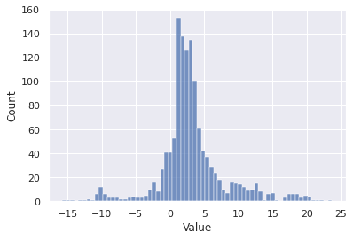
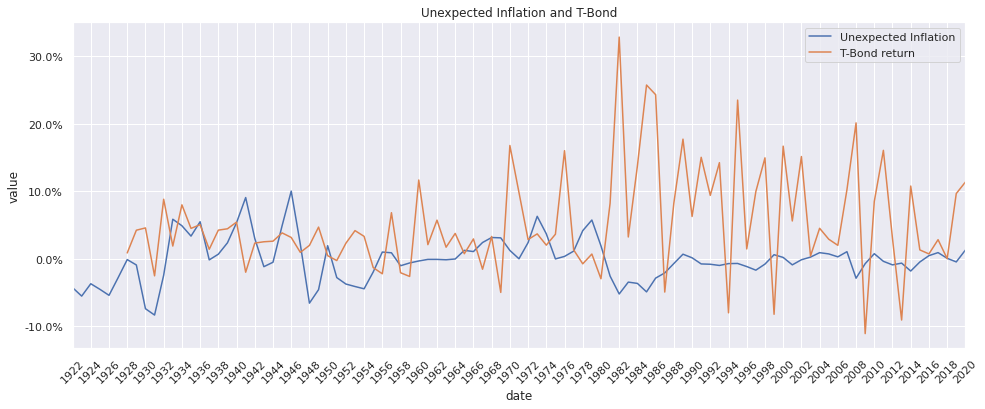
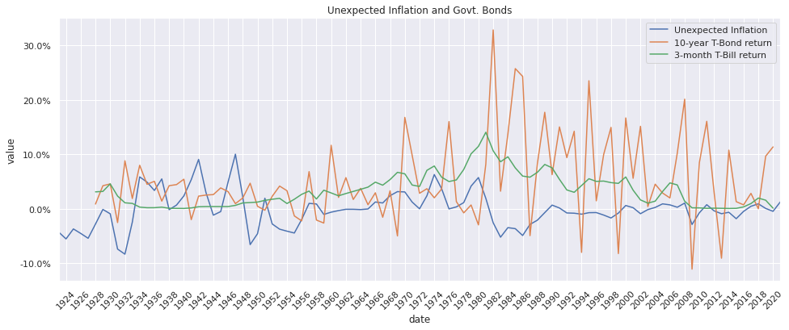
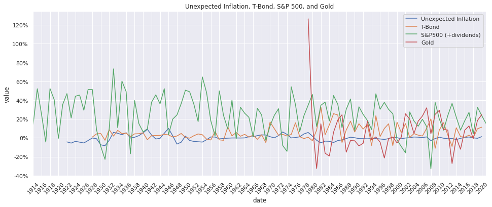
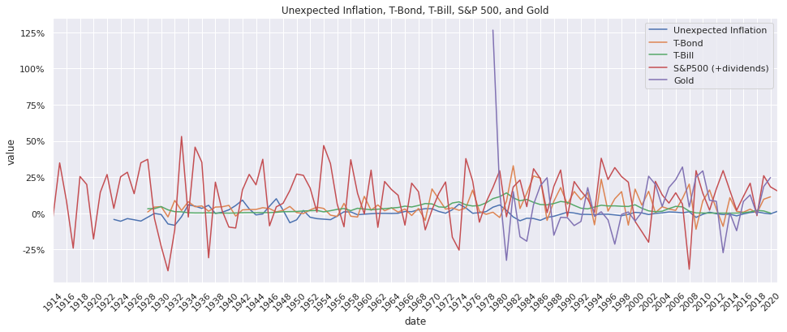
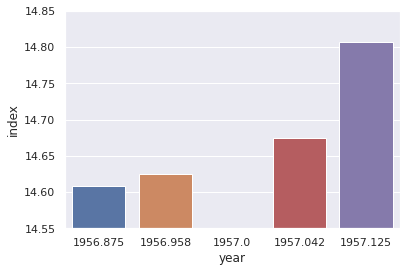
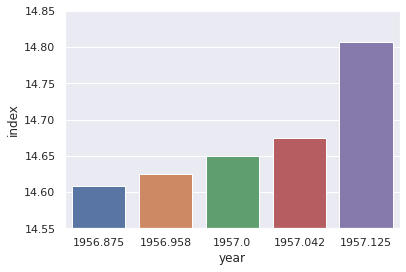
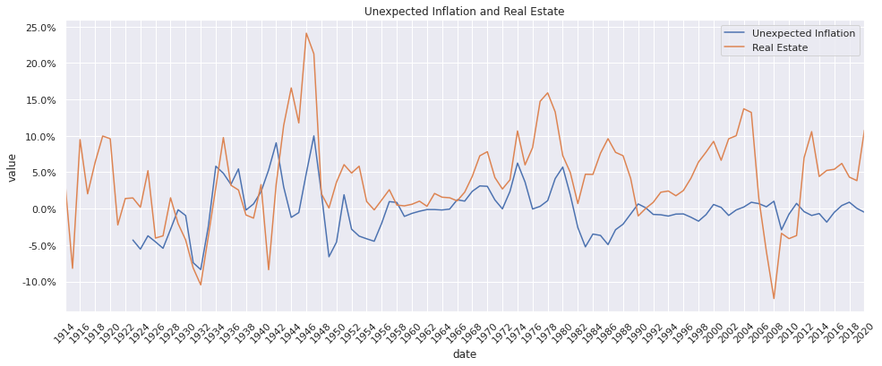
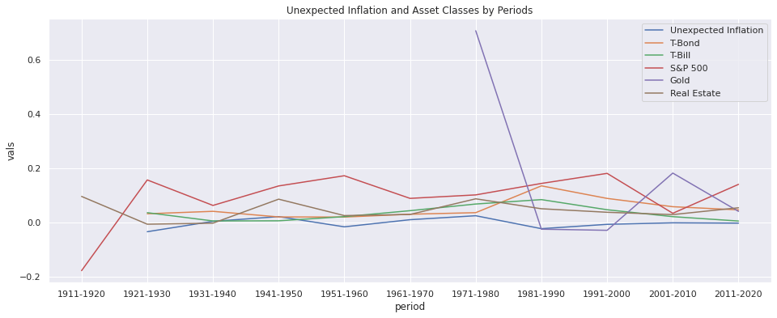
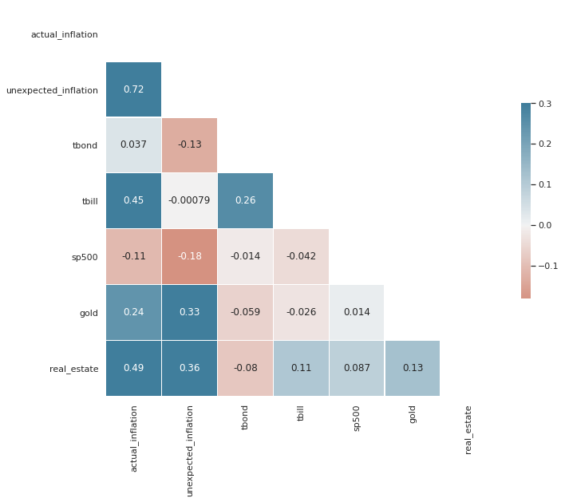

# Which Asset Class is safe against unexpected inflation?

This notebook attempts to duplicate this analysis by prof. Damodaran:

[Inflation and Investing: False Alarm or Fair Warning?](https://www.youtube.com/watch?v=p0vqmjgF3E4)

I thought it might be interesting to be able to get the latest data whenever we need to perform this analysis in the future.

Data source locations:

- Inflation: https://www.quandl.com/data/RATEINF/CPI_USA-Consumer-Price-Index-USA (need to sign up for an account to download)
- T-Bond: [Damodaran Online: Historical Returns on Stocks, Bonds and Bills](http://pages.stern.nyu.edu/~adamodar/New_Home_Page/datafile/histretSP.html) (I could not find a larger data source than the one in prof. Damodaran's website so I used it)
- Gold: [Gold Prices Dataset from Gold Hub](https://www.gold.org/goldhub/data/gold-prices) (need to sign up for an account to download)
- S&P 500 and Real Estate: [ONLINE DATA ROBERT SHILLER](http://www.econ.yale.edu/~shiller/data.htm) (Much thanks to Prof. Robert J. Shiller for providing this dataset)


```python
import numpy as np
import pandas as pd
from matplotlib import pyplot as plt
import seaborn as sns
from pandas.tseries.offsets import MonthEnd, YearEnd, YearBegin
from IPython.display import display
import matplotlib.dates as mdates
import matplotlib.ticker as mtick
from styles import style as style_df, format_row_wise, round_or_null, percent_or_null

INFLATION_DATA = 'data/inflation.csv'
TBOND_DATA = 'data/histretSP.xls'
SP500_DATA = 'data/sp500.xls'
GOLD_DATA = 'data/gold.xlsx'
REAL_ESTATE_DATA = 'data/real_estate.xls'
```

## 1. Prepare Expected and Unexpected Inflation Rates


```python
inf = pd.read_csv(INFLATION_DATA)
```

### Assess


```python
display(inf)
inf.info()
```


<div>
<style scoped>
    .dataframe tbody tr th:only-of-type {
        vertical-align: middle;
    }

    .dataframe tbody tr th {
        vertical-align: top;
    }

    .dataframe thead th {
        text-align: right;
    }
</style>
<table border="1" class="dataframe">
  <thead>
    <tr style="text-align: right;">
      <th></th>
      <th>Date</th>
      <th>Value</th>
    </tr>
  </thead>
  <tbody>
    <tr>
      <th>0</th>
      <td>2021-05-31</td>
      <td>4.993</td>
    </tr>
    <tr>
      <th>1</th>
      <td>2021-04-30</td>
      <td>4.160</td>
    </tr>
    <tr>
      <th>2</th>
      <td>2021-03-31</td>
      <td>2.620</td>
    </tr>
    <tr>
      <th>3</th>
      <td>2021-02-28</td>
      <td>1.676</td>
    </tr>
    <tr>
      <th>4</th>
      <td>2021-01-31</td>
      <td>1.400</td>
    </tr>
    <tr>
      <th>...</th>
      <td>...</td>
      <td>...</td>
    </tr>
    <tr>
      <th>1284</th>
      <td>1914-05-31</td>
      <td>2.062</td>
    </tr>
    <tr>
      <th>1285</th>
      <td>1914-04-30</td>
      <td>0.000</td>
    </tr>
    <tr>
      <th>1286</th>
      <td>1914-03-31</td>
      <td>1.020</td>
    </tr>
    <tr>
      <th>1287</th>
      <td>1914-02-28</td>
      <td>1.020</td>
    </tr>
    <tr>
      <th>1288</th>
      <td>1914-01-31</td>
      <td>2.041</td>
    </tr>
  </tbody>
</table>
<p>1289 rows × 2 columns</p>
</div>


    <class 'pandas.core.frame.DataFrame'>
    RangeIndex: 1289 entries, 0 to 1288
    Data columns (total 2 columns):
     #   Column  Non-Null Count  Dtype  
    ---  ------  --------------  -----  
     0   Date    1289 non-null   object
     1   Value   1289 non-null   float64
    dtypes: float64(1), object(1)
    memory usage: 20.3+ KB


```python
sns.set_theme()
sns.histplot(data=inf, x="Value");
```





### Clean


```python
inf = inf.rename(columns={'Date': 'date', 'Value': 'value'})
inf['date'] = pd.to_datetime(inf['date'])
inf.set_index('date', inplace=True)
inf['value'] = inf['value'] / 100
inf = inf.groupby(pd.Grouper(freq="Y")).value.mean().to_frame(name='actual_inflation')
```

### Test


```python
inf.info()
display(inf)
```

    <class 'pandas.core.frame.DataFrame'>
    DatetimeIndex: 108 entries, 1914-12-31 to 2021-12-31
    Freq: A-DEC
    Data columns (total 1 columns):
     #   Column            Non-Null Count  Dtype  
    ---  ------            --------------  -----  
     0   actual_inflation  108 non-null    float64
    dtypes: float64(1)
    memory usage: 1.7 KB


<div>
<style scoped>
    .dataframe tbody tr th:only-of-type {
        vertical-align: middle;
    }

    .dataframe tbody tr th {
        vertical-align: top;
    }

    .dataframe thead th {
        text-align: right;
    }
</style>
<table border="1" class="dataframe">
  <thead>
    <tr style="text-align: right;">
      <th></th>
      <th>actual_inflation</th>
    </tr>
    <tr>
      <th>date</th>
      <th></th>
    </tr>
  </thead>
  <tbody>
    <tr>
      <th>1914-12-31</th>
      <td>0.013494</td>
    </tr>
    <tr>
      <th>1915-12-31</th>
      <td>0.009234</td>
    </tr>
    <tr>
      <th>1916-12-31</th>
      <td>0.076426</td>
    </tr>
    <tr>
      <th>1917-12-31</th>
      <td>0.178002</td>
    </tr>
    <tr>
      <th>1918-12-31</th>
      <td>0.172546</td>
    </tr>
    <tr>
      <th>...</th>
      <td>...</td>
    </tr>
    <tr>
      <th>2017-12-31</th>
      <td>0.021301</td>
    </tr>
    <tr>
      <th>2018-12-31</th>
      <td>0.024428</td>
    </tr>
    <tr>
      <th>2019-12-31</th>
      <td>0.018117</td>
    </tr>
    <tr>
      <th>2020-12-31</th>
      <td>0.012367</td>
    </tr>
    <tr>
      <th>2021-12-31</th>
      <td>0.029698</td>
    </tr>
  </tbody>
</table>
<p>108 rows × 1 columns</p>
</div>


```python
sns.set_theme()
sns.histplot(data=inf, x="actual_inflation");
```


```python
plt.figure(figsize=(16, 6))
sns.set_theme()
sns.lineplot(data=inf, x=inf.index, y="actual_inflation");
```





```python
inf = inf.sort_values(by='date')
inf['avg_past_10y'] = inf['actual_inflation'].rolling(10).mean()
inf['unexpected_inflation'] = inf['actual_inflation'] - inf['avg_past_10y']
inf[:12]
```


<div>
<style scoped>
    .dataframe tbody tr th:only-of-type {
        vertical-align: middle;
    }

    .dataframe tbody tr th {
        vertical-align: top;
    }

    .dataframe thead th {
        text-align: right;
    }
</style>
<table border="1" class="dataframe">
  <thead>
    <tr style="text-align: right;">
      <th></th>
      <th>actual_inflation</th>
      <th>avg_past_10y</th>
      <th>unexpected_inflation</th>
    </tr>
    <tr>
      <th>date</th>
      <th></th>
      <th></th>
      <th></th>
    </tr>
  </thead>
  <tbody>
    <tr>
      <th>1914-12-31</th>
      <td>0.013494</td>
      <td>NaN</td>
      <td>NaN</td>
    </tr>
    <tr>
      <th>1915-12-31</th>
      <td>0.009234</td>
      <td>NaN</td>
      <td>NaN</td>
    </tr>
    <tr>
      <th>1916-12-31</th>
      <td>0.076426</td>
      <td>NaN</td>
      <td>NaN</td>
    </tr>
    <tr>
      <th>1917-12-31</th>
      <td>0.178002</td>
      <td>NaN</td>
      <td>NaN</td>
    </tr>
    <tr>
      <th>1918-12-31</th>
      <td>0.172546</td>
      <td>NaN</td>
      <td>NaN</td>
    </tr>
    <tr>
      <th>1919-12-31</th>
      <td>0.153107</td>
      <td>NaN</td>
      <td>NaN</td>
    </tr>
    <tr>
      <th>1920-12-31</th>
      <td>0.158990</td>
      <td>NaN</td>
      <td>NaN</td>
    </tr>
    <tr>
      <th>1921-12-31</th>
      <td>-0.108520</td>
      <td>NaN</td>
      <td>NaN</td>
    </tr>
    <tr>
      <th>1922-12-31</th>
      <td>-0.061018</td>
      <td>NaN</td>
      <td>NaN</td>
    </tr>
    <tr>
      <th>1923-12-31</th>
      <td>0.017958</td>
      <td>0.061022</td>
      <td>-0.043064</td>
    </tr>
    <tr>
      <th>1924-12-31</th>
      <td>0.004520</td>
      <td>0.060125</td>
      <td>-0.055605</td>
    </tr>
    <tr>
      <th>1925-12-31</th>
      <td>0.024345</td>
      <td>0.061636</td>
      <td>-0.037291</td>
    </tr>
  </tbody>
</table>
</div>


```python
def plot_multilines(df, x, Y):
    df_plot = df.reset_index()[[x]+Y]
    if pd.api.types.is_datetime64_ns_dtype(df_plot[x].dtype):
        df_plot[x] = df_plot[x] - YearBegin(1)
    df_plot = df_plot.melt(x, var_name='cols', value_name='vals')
    plt.figure(figsize=(16, 6))
    sns.set_theme()
    ax = sns.lineplot(x=x, y='vals', hue='cols', data=df_plot)
    return ax


def style(ax, labels=None, year_gap=2):
    ax.xaxis.set_major_locator(mdates.YearLocator(year_gap))
    ax.xaxis.set_major_formatter(mdates.DateFormatter("%Y"))
    ax.yaxis.set_major_formatter(mtick.PercentFormatter(1.0))
    ax.margins(x=0)
    ax.set(ylabel="value")
    ax.legend(title="")
    if labels != None:
        legend = ax.legend()
        for i, l in enumerate(labels):
            legend.texts[i].set_text(l)
    return plt.xticks(rotation=45)

ax = plot_multilines(inf, 'date', ['avg_past_10y', 'actual_inflation', 'unexpected_inflation'])
ax = style(ax);
```


## 2. 10-year US T-Bond and 3-month US T-Bill


```python
tbond = pd.read_excel(TBOND_DATA,
                      sheet_name="Returns by year",
                      skiprows=list(range(0,17)))
tbond = tbond[['Year', 'US T. Bond', '3-month T.Bill']]
tbond = tbond.rename(columns={'Year': 'date', 'US T. Bond': 'tbond', '3-month T.Bill': 'tbill'})
eof_id = tbond[tbond['date'] == 'Arithmetic Average Historical Return'].index[0]
tbond = tbond.iloc[0:eof_id].dropna()
tbond['date'] = pd.to_datetime(tbond['date'], format='%Y') + YearEnd(1)
tbond = tbond.set_index('date')
```


```python
combined1 = pd.merge(inf, tbond, left_on='date', right_on='date', how='left')
combined1 = combined1[['actual_inflation', 'unexpected_inflation', 'tbond', 'tbill']]
```


```python
ax = plot_multilines(combined1, 'date', ['unexpected_inflation', 'tbond', 'tbill'])
style(ax, ["Unexpected Inflation", "10-year T-Bond return", "3-month T-Bill return"])
ax.set_title("Unexpected Inflation and Govt. Bonds");
```





## 3. S&P 500 Index


```python
sp500 = pd.read_excel(SP500_DATA,
                      sheet_name="Data",
                      skiprows=list(range(0,7))
                      )
sp500 = sp500.iloc[:-1, :3]
sp500 = sp500.rename(columns={'Date': 'date', 'P': 'price', 'D': 'dividend'})

# 1871.1 to 1871.10
sp500['date'] = sp500['date'].apply(lambda x: '{0:.2f}'.format(x))

sp500['date'] = sp500['date'].astype(str)
sp500['price'] = sp500['price'].astype(float)
sp500['date'] = pd.to_datetime(sp500['date'], format="%Y.%m")
sp500['date'] = sp500['date'] + MonthEnd(1)
sp500.set_index('date', inplace=True)
```


```python
def get_earnings_plus_dividends_yoy(df):
    g = df.groupby(pd.Grouper(freq="Y"))
    dividend = g.dividend.mean()
    firstp = g.price.last().shift(1)
    lastp = g.price.last()
    lastp_div = lastp + dividend
    comb = firstp.to_frame(name='first') \
           .join(lastp.to_frame(name='last')) \
           .join(dividend.to_frame(name='dividend')) \
           .join(lastp_div.to_frame(name='last_plus_dividend'))
    comb['yoy_change'] = (comb['last_plus_dividend'] / comb['first']) - 1
    return comb
sp500g = get_earnings_plus_dividends_yoy(sp500)
sp500g = sp500g[sp500g.index.year >= inf.index[0].year]
sp500g
```


<div>
<style scoped>
    .dataframe tbody tr th:only-of-type {
        vertical-align: middle;
    }

    .dataframe tbody tr th {
        vertical-align: top;
    }

    .dataframe thead th {
        text-align: right;
    }
</style>
<table border="1" class="dataframe">
  <thead>
    <tr style="text-align: right;">
      <th></th>
      <th>first</th>
      <th>last</th>
      <th>dividend</th>
      <th>last_plus_dividend</th>
      <th>yoy_change</th>
    </tr>
    <tr>
      <th>date</th>
      <th></th>
      <th></th>
      <th></th>
      <th></th>
      <th></th>
    </tr>
  </thead>
  <tbody>
    <tr>
      <th>1914-12-31</th>
      <td>8.040000</td>
      <td>7.350000</td>
      <td>0.447500</td>
      <td>7.797500</td>
      <td>-0.030162</td>
    </tr>
    <tr>
      <th>1915-12-31</th>
      <td>7.350000</td>
      <td>9.480000</td>
      <td>0.425417</td>
      <td>9.905417</td>
      <td>0.347676</td>
    </tr>
    <tr>
      <th>1916-12-31</th>
      <td>9.480000</td>
      <td>9.800000</td>
      <td>0.500417</td>
      <td>10.300417</td>
      <td>0.086542</td>
    </tr>
    <tr>
      <th>1917-12-31</th>
      <td>9.800000</td>
      <td>6.800000</td>
      <td>0.630417</td>
      <td>7.430417</td>
      <td>-0.241794</td>
    </tr>
    <tr>
      <th>1918-12-31</th>
      <td>6.800000</td>
      <td>7.900000</td>
      <td>0.625000</td>
      <td>8.525000</td>
      <td>0.253676</td>
    </tr>
    <tr>
      <th>...</th>
      <td>...</td>
      <td>...</td>
      <td>...</td>
      <td>...</td>
      <td>...</td>
    </tr>
    <tr>
      <th>2017-12-31</th>
      <td>2246.630000</td>
      <td>2664.340000</td>
      <td>47.405833</td>
      <td>2711.745833</td>
      <td>0.207028</td>
    </tr>
    <tr>
      <th>2018-12-31</th>
      <td>2664.340000</td>
      <td>2567.310000</td>
      <td>51.368333</td>
      <td>2618.678333</td>
      <td>-0.017138</td>
    </tr>
    <tr>
      <th>2019-12-31</th>
      <td>2567.310000</td>
      <td>3176.749524</td>
      <td>56.245152</td>
      <td>3232.994676</td>
      <td>0.259293</td>
    </tr>
    <tr>
      <th>2020-12-31</th>
      <td>3176.749524</td>
      <td>3695.310000</td>
      <td>59.094125</td>
      <td>3754.404125</td>
      <td>0.181838</td>
    </tr>
    <tr>
      <th>2021-12-31</th>
      <td>3695.310000</td>
      <td>4208.120000</td>
      <td>57.848540</td>
      <td>4265.968540</td>
      <td>0.154428</td>
    </tr>
  </tbody>
</table>
<p>108 rows × 5 columns</p>
</div>


```python
ax = plot_multilines(sp500g, 'date', ['yoy_change'])
style(ax);
```


### Merging unexpected inflation + S&P 500 Index


```python
combined2 = pd.merge(combined1, sp500g, left_on='date', right_on='date', how='left')
combined2 = combined2.rename(columns={'yoy_change': 'sp500'})
combined2 = combined2[['actual_inflation', 'unexpected_inflation', 'tbond', 'tbill', 'sp500']]
```


```python
combined2
```


<div>
<style scoped>
    .dataframe tbody tr th:only-of-type {
        vertical-align: middle;
    }

    .dataframe tbody tr th {
        vertical-align: top;
    }

    .dataframe thead th {
        text-align: right;
    }
</style>
<table border="1" class="dataframe">
  <thead>
    <tr style="text-align: right;">
      <th></th>
      <th>actual_inflation</th>
      <th>unexpected_inflation</th>
      <th>tbond</th>
      <th>tbill</th>
      <th>sp500</th>
    </tr>
    <tr>
      <th>date</th>
      <th></th>
      <th></th>
      <th></th>
      <th></th>
      <th></th>
    </tr>
  </thead>
  <tbody>
    <tr>
      <th>1914-12-31</th>
      <td>0.013494</td>
      <td>NaN</td>
      <td>NaN</td>
      <td>NaN</td>
      <td>-0.030162</td>
    </tr>
    <tr>
      <th>1915-12-31</th>
      <td>0.009234</td>
      <td>NaN</td>
      <td>NaN</td>
      <td>NaN</td>
      <td>0.347676</td>
    </tr>
    <tr>
      <th>1916-12-31</th>
      <td>0.076426</td>
      <td>NaN</td>
      <td>NaN</td>
      <td>NaN</td>
      <td>0.086542</td>
    </tr>
    <tr>
      <th>1917-12-31</th>
      <td>0.178002</td>
      <td>NaN</td>
      <td>NaN</td>
      <td>NaN</td>
      <td>-0.241794</td>
    </tr>
    <tr>
      <th>1918-12-31</th>
      <td>0.172546</td>
      <td>NaN</td>
      <td>NaN</td>
      <td>NaN</td>
      <td>0.253676</td>
    </tr>
    <tr>
      <th>...</th>
      <td>...</td>
      <td>...</td>
      <td>...</td>
      <td>...</td>
      <td>...</td>
    </tr>
    <tr>
      <th>2017-12-31</th>
      <td>0.021301</td>
      <td>0.004320</td>
      <td>0.028017</td>
      <td>0.009308</td>
      <td>0.207028</td>
    </tr>
    <tr>
      <th>2018-12-31</th>
      <td>0.024428</td>
      <td>0.008850</td>
      <td>-0.000167</td>
      <td>0.019392</td>
      <td>-0.017138</td>
    </tr>
    <tr>
      <th>2019-12-31</th>
      <td>0.018117</td>
      <td>0.000389</td>
      <td>0.096356</td>
      <td>0.015500</td>
      <td>0.259293</td>
    </tr>
    <tr>
      <th>2020-12-31</th>
      <td>0.012367</td>
      <td>-0.004953</td>
      <td>0.113319</td>
      <td>0.000900</td>
      <td>0.181838</td>
    </tr>
    <tr>
      <th>2021-12-31</th>
      <td>0.029698</td>
      <td>0.012564</td>
      <td>NaN</td>
      <td>NaN</td>
      <td>0.154428</td>
    </tr>
  </tbody>
</table>
<p>108 rows × 5 columns</p>
</div>


```python
ax = plot_multilines(combined2, 'date', ['unexpected_inflation', 'tbond', 'tbill', 'sp500'])
style(ax, ["Unexpected Inflation", "T-Bond", "T-Bill" "S&P500 return (+ dividends)"])
ax.set_title("Unexpected Inflation, T-Bond, T-Bill, and S&P 500");
```





## 4. Gold


```python
gold = pd.read_excel(GOLD_DATA,
                     sheet_name="Annual_EndofPeriod",
                     skiprows=list(range(0,9)),
                     header=None,
                     engine="openpyxl")
gold = gold.iloc[:, 3:5]
gold = gold.rename(columns={3: 'date', 4: 'price'})
gold['date'] = pd.to_datetime(gold['date'], format='%Y') + YearEnd(1)
gold = gold.set_index('date')
gold['firstp'] = gold['price'].shift(1)
gold['yoy_change'] = (gold['price'] / gold['firstp']) - 1
```


```python
gold.head(5)
```


<div>
<style scoped>
    .dataframe tbody tr th:only-of-type {
        vertical-align: middle;
    }

    .dataframe tbody tr th {
        vertical-align: top;
    }

    .dataframe thead th {
        text-align: right;
    }
</style>
<table border="1" class="dataframe">
  <thead>
    <tr style="text-align: right;">
      <th></th>
      <th>price</th>
      <th>firstp</th>
      <th>yoy_change</th>
    </tr>
    <tr>
      <th>date</th>
      <th></th>
      <th></th>
      <th></th>
    </tr>
  </thead>
  <tbody>
    <tr>
      <th>1978-12-31</th>
      <td>226.00</td>
      <td>NaN</td>
      <td>NaN</td>
    </tr>
    <tr>
      <th>1979-12-31</th>
      <td>512.00</td>
      <td>226.00</td>
      <td>1.265487</td>
    </tr>
    <tr>
      <th>1980-12-31</th>
      <td>589.75</td>
      <td>512.00</td>
      <td>0.151855</td>
    </tr>
    <tr>
      <th>1981-12-31</th>
      <td>397.50</td>
      <td>589.75</td>
      <td>-0.325986</td>
    </tr>
    <tr>
      <th>1982-12-31</th>
      <td>456.90</td>
      <td>397.50</td>
      <td>0.149434</td>
    </tr>
  </tbody>
</table>
</div>


```python
combined3 = pd.merge(combined2, gold, left_on='date', right_on='date', how='left')
combined3 = combined3.rename(columns={'yoy_change': 'gold'})
combined3 = combined3[['actual_inflation', 'unexpected_inflation', 'tbond', 'tbill', 'sp500', 'gold']]
```


```python
combined3
```


<div>
<style scoped>
    .dataframe tbody tr th:only-of-type {
        vertical-align: middle;
    }

    .dataframe tbody tr th {
        vertical-align: top;
    }

    .dataframe thead th {
        text-align: right;
    }
</style>
<table border="1" class="dataframe">
  <thead>
    <tr style="text-align: right;">
      <th></th>
      <th>actual_inflation</th>
      <th>unexpected_inflation</th>
      <th>tbond</th>
      <th>tbill</th>
      <th>sp500</th>
      <th>gold</th>
    </tr>
    <tr>
      <th>date</th>
      <th></th>
      <th></th>
      <th></th>
      <th></th>
      <th></th>
      <th></th>
    </tr>
  </thead>
  <tbody>
    <tr>
      <th>1914-12-31</th>
      <td>0.013494</td>
      <td>NaN</td>
      <td>NaN</td>
      <td>NaN</td>
      <td>-0.030162</td>
      <td>NaN</td>
    </tr>
    <tr>
      <th>1915-12-31</th>
      <td>0.009234</td>
      <td>NaN</td>
      <td>NaN</td>
      <td>NaN</td>
      <td>0.347676</td>
      <td>NaN</td>
    </tr>
    <tr>
      <th>1916-12-31</th>
      <td>0.076426</td>
      <td>NaN</td>
      <td>NaN</td>
      <td>NaN</td>
      <td>0.086542</td>
      <td>NaN</td>
    </tr>
    <tr>
      <th>1917-12-31</th>
      <td>0.178002</td>
      <td>NaN</td>
      <td>NaN</td>
      <td>NaN</td>
      <td>-0.241794</td>
      <td>NaN</td>
    </tr>
    <tr>
      <th>1918-12-31</th>
      <td>0.172546</td>
      <td>NaN</td>
      <td>NaN</td>
      <td>NaN</td>
      <td>0.253676</td>
      <td>NaN</td>
    </tr>
    <tr>
      <th>...</th>
      <td>...</td>
      <td>...</td>
      <td>...</td>
      <td>...</td>
      <td>...</td>
      <td>...</td>
    </tr>
    <tr>
      <th>2017-12-31</th>
      <td>0.021301</td>
      <td>0.004320</td>
      <td>0.028017</td>
      <td>0.009308</td>
      <td>0.207028</td>
      <td>0.126625</td>
    </tr>
    <tr>
      <th>2018-12-31</th>
      <td>0.024428</td>
      <td>0.008850</td>
      <td>-0.000167</td>
      <td>0.019392</td>
      <td>-0.017138</td>
      <td>-0.009295</td>
    </tr>
    <tr>
      <th>2019-12-31</th>
      <td>0.018117</td>
      <td>0.000389</td>
      <td>0.096356</td>
      <td>0.015500</td>
      <td>0.259293</td>
      <td>0.184324</td>
    </tr>
    <tr>
      <th>2020-12-31</th>
      <td>0.012367</td>
      <td>-0.004953</td>
      <td>0.113319</td>
      <td>0.000900</td>
      <td>0.181838</td>
      <td>0.246146</td>
    </tr>
    <tr>
      <th>2021-12-31</th>
      <td>0.029698</td>
      <td>0.012564</td>
      <td>NaN</td>
      <td>NaN</td>
      <td>0.154428</td>
      <td>NaN</td>
    </tr>
  </tbody>
</table>
<p>108 rows × 6 columns</p>
</div>


```python
ax = plot_multilines(combined3, 'date', ['unexpected_inflation', 'tbond', 'tbill', 'sp500', 'gold'])
style(ax, ["Unexpected Inflation", "T-Bond", "T-Bill", "S&P500 (+dividends)", "Gold"])
ax.set_title("Unexpected Inflation, T-Bond, T-Bill, S&P 500, and Gold");
```





## 5. Real Estate


```python
real_estate = pd.read_excel(REAL_ESTATE_DATA,
                            sheet_name="Data",
                            skiprows=list(range(0,6)),
                            engine="xlrd")
real_estate = real_estate.rename(columns={'Date': 'year', 'From fig2.1Revised2011.xls': 'index'})
real_estate = real_estate[['year', 'index']]
real_estate = real_estate.dropna()

def impute_values(df, id_field, value_field):
    """ Impute missing values in `df` by looking at id differences.


    """
    # Create rows with values for missing years set to None
    indices = pd.Index(np.arange(df[id_field].min(), df[id_field].max(), 1))
    df1 = df.set_index(id_field)
    missing_indices = indices.difference(df1.index)
    for idx in missing_indices:
        df1.loc[idx, value_field] = None

    # Interpolate None values
    df1 = df1.sort_index()
    df1[value_field] = df1[value_field].interpolate(method='linear')

    # Remove non-whole values
    df1 = df1.loc[df1.index % 1 == 0]

    # Reduce years by 1
    df1 = df1.reset_index()
    df1.loc[df1.year.isin(missing_indices), 'year'] -= 1
    df1 = df1.set_index('year')
    return df1

real_estate = impute_values(real_estate, 'year', 'index')

real_estate['date'] = pd.to_datetime(real_estate.index.astype(int), format="%Y") + YearEnd(1)
real_estate = real_estate.set_index('date')
real_estate['prev_index'] = real_estate['index'].shift(1)
real_estate['yoy_change'] = real_estate['index'] / real_estate['prev_index'] - 1
real_estate = real_estate.dropna()
real_estate['yoy_change'] = real_estate['yoy_change'].astype(float)
real_estate
```


<div>
<style scoped>
    .dataframe tbody tr th:only-of-type {
        vertical-align: middle;
    }

    .dataframe tbody tr th {
        vertical-align: top;
    }

    .dataframe thead th {
        text-align: right;
    }
</style>
<table border="1" class="dataframe">
  <thead>
    <tr style="text-align: right;">
      <th></th>
      <th>index</th>
      <th>prev_index</th>
      <th>yoy_change</th>
    </tr>
    <tr>
      <th>date</th>
      <th></th>
      <th></th>
      <th></th>
    </tr>
  </thead>
  <tbody>
    <tr>
      <th>1891-12-31</th>
      <td>3.209111</td>
      <td>3.557296</td>
      <td>-0.097879</td>
    </tr>
    <tr>
      <th>1892-12-31</th>
      <td>3.267142</td>
      <td>3.209111</td>
      <td>0.018083</td>
    </tr>
    <tr>
      <th>1893-12-31</th>
      <td>3.406416</td>
      <td>3.267142</td>
      <td>0.042629</td>
    </tr>
    <tr>
      <th>1894-12-31</th>
      <td>3.969316</td>
      <td>3.406416</td>
      <td>0.165247</td>
    </tr>
    <tr>
      <th>1895-12-31</th>
      <td>3.603721</td>
      <td>3.969316</td>
      <td>-0.092105</td>
    </tr>
    <tr>
      <th>...</th>
      <td>...</td>
      <td>...</td>
      <td>...</td>
    </tr>
    <tr>
      <th>2016-12-31</th>
      <td>184.580000</td>
      <td>175.110000</td>
      <td>0.054080</td>
    </tr>
    <tr>
      <th>2017-12-31</th>
      <td>196.045000</td>
      <td>184.580000</td>
      <td>0.062114</td>
    </tr>
    <tr>
      <th>2018-12-31</th>
      <td>204.545000</td>
      <td>196.045000</td>
      <td>0.043357</td>
    </tr>
    <tr>
      <th>2019-12-31</th>
      <td>212.420000</td>
      <td>204.545000</td>
      <td>0.038500</td>
    </tr>
    <tr>
      <th>2020-12-31</th>
      <td>235.325000</td>
      <td>212.420000</td>
      <td>0.107829</td>
    </tr>
  </tbody>
</table>
<p>131 rows × 3 columns</p>
</div>


### Understanding how Interpolation works


```python
df = pd.read_excel(REAL_ESTATE_DATA,
                   sheet_name="Data",
                   skiprows=list(range(0,6)),
                   engine="xlrd")
df = df.rename(columns={'Date': 'year', 'From fig2.1Revised2011.xls': 'index'})
df = df[['year', 'index']]
df = df.dropna()
df = df.iloc[109:113]
df['year'] = df['year'].round(3)
df = df.set_index('year')
df.loc[1957.0, 'index'] = None
df = df.sort_index()
ax = sns.barplot(data=df, x=df.index, y='index')
ax.set(ylim=(14.55, 14.85));
display(df)
```


<div>
<style scoped>
    .dataframe tbody tr th:only-of-type {
        vertical-align: middle;
    }

    .dataframe tbody tr th {
        vertical-align: top;
    }

    .dataframe thead th {
        text-align: right;
    }
</style>
<table border="1" class="dataframe">
  <thead>
    <tr style="text-align: right;">
      <th></th>
      <th>index</th>
    </tr>
    <tr>
      <th>year</th>
      <th></th>
    </tr>
  </thead>
  <tbody>
    <tr>
      <th>1956.875</th>
      <td>14.608379</td>
    </tr>
    <tr>
      <th>1956.958</th>
      <td>14.624941</td>
    </tr>
    <tr>
      <th>1957.000</th>
      <td>NaN</td>
    </tr>
    <tr>
      <th>1957.042</th>
      <td>14.674630</td>
    </tr>
    <tr>
      <th>1957.125</th>
      <td>14.807132</td>
    </tr>
  </tbody>
</table>
</div>





```python
df['index'] = df['index'].interpolate(method='linear')
ax = sns.barplot(data=df, x=df.index, y='index')
ax.set(ylim=(14.55, 14.85));
display(df)
```


<div>
<style scoped>
    .dataframe tbody tr th:only-of-type {
        vertical-align: middle;
    }

    .dataframe tbody tr th {
        vertical-align: top;
    }

    .dataframe thead th {
        text-align: right;
    }
</style>
<table border="1" class="dataframe">
  <thead>
    <tr style="text-align: right;">
      <th></th>
      <th>index</th>
    </tr>
    <tr>
      <th>year</th>
      <th></th>
    </tr>
  </thead>
  <tbody>
    <tr>
      <th>1956.875</th>
      <td>14.608379</td>
    </tr>
    <tr>
      <th>1956.958</th>
      <td>14.624941</td>
    </tr>
    <tr>
      <th>1957.000</th>
      <td>14.649786</td>
    </tr>
    <tr>
      <th>1957.042</th>
      <td>14.674630</td>
    </tr>
    <tr>
      <th>1957.125</th>
      <td>14.807132</td>
    </tr>
  </tbody>
</table>
</div>





### Back to preparing real estate data


```python
combined4 = pd.merge(combined3, real_estate, left_on='date', right_on='date')
combined4 = combined4.rename(columns={'yoy_change': 'real_estate'})
combined4 = combined4[['actual_inflation', 'unexpected_inflation', 'tbond', 'tbill', 'sp500', 'gold', 'real_estate']]
```


```python
combined4
```


<div>
<style scoped>
    .dataframe tbody tr th:only-of-type {
        vertical-align: middle;
    }

    .dataframe tbody tr th {
        vertical-align: top;
    }

    .dataframe thead th {
        text-align: right;
    }
</style>
<table border="1" class="dataframe">
  <thead>
    <tr style="text-align: right;">
      <th></th>
      <th>actual_inflation</th>
      <th>unexpected_inflation</th>
      <th>tbond</th>
      <th>tbill</th>
      <th>sp500</th>
      <th>gold</th>
      <th>real_estate</th>
    </tr>
    <tr>
      <th>date</th>
      <th></th>
      <th></th>
      <th></th>
      <th></th>
      <th></th>
      <th></th>
      <th></th>
    </tr>
  </thead>
  <tbody>
    <tr>
      <th>1914-12-31</th>
      <td>0.013494</td>
      <td>NaN</td>
      <td>NaN</td>
      <td>NaN</td>
      <td>-0.030162</td>
      <td>NaN</td>
      <td>0.037185</td>
    </tr>
    <tr>
      <th>1915-12-31</th>
      <td>0.009234</td>
      <td>NaN</td>
      <td>NaN</td>
      <td>NaN</td>
      <td>0.347676</td>
      <td>NaN</td>
      <td>-0.081946</td>
    </tr>
    <tr>
      <th>1916-12-31</th>
      <td>0.076426</td>
      <td>NaN</td>
      <td>NaN</td>
      <td>NaN</td>
      <td>0.086542</td>
      <td>NaN</td>
      <td>0.094840</td>
    </tr>
    <tr>
      <th>1917-12-31</th>
      <td>0.178002</td>
      <td>NaN</td>
      <td>NaN</td>
      <td>NaN</td>
      <td>-0.241794</td>
      <td>NaN</td>
      <td>0.020382</td>
    </tr>
    <tr>
      <th>1918-12-31</th>
      <td>0.172546</td>
      <td>NaN</td>
      <td>NaN</td>
      <td>NaN</td>
      <td>0.253676</td>
      <td>NaN</td>
      <td>0.063670</td>
    </tr>
    <tr>
      <th>...</th>
      <td>...</td>
      <td>...</td>
      <td>...</td>
      <td>...</td>
      <td>...</td>
      <td>...</td>
      <td>...</td>
    </tr>
    <tr>
      <th>2016-12-31</th>
      <td>0.012636</td>
      <td>-0.005067</td>
      <td>0.006906</td>
      <td>0.003175</td>
      <td>0.115441</td>
      <td>0.081038</td>
      <td>0.054080</td>
    </tr>
    <tr>
      <th>2017-12-31</th>
      <td>0.021301</td>
      <td>0.004320</td>
      <td>0.028017</td>
      <td>0.009308</td>
      <td>0.207028</td>
      <td>0.126625</td>
      <td>0.062114</td>
    </tr>
    <tr>
      <th>2018-12-31</th>
      <td>0.024428</td>
      <td>0.008850</td>
      <td>-0.000167</td>
      <td>0.019392</td>
      <td>-0.017138</td>
      <td>-0.009295</td>
      <td>0.043357</td>
    </tr>
    <tr>
      <th>2019-12-31</th>
      <td>0.018117</td>
      <td>0.000389</td>
      <td>0.096356</td>
      <td>0.015500</td>
      <td>0.259293</td>
      <td>0.184324</td>
      <td>0.038500</td>
    </tr>
    <tr>
      <th>2020-12-31</th>
      <td>0.012367</td>
      <td>-0.004953</td>
      <td>0.113319</td>
      <td>0.000900</td>
      <td>0.181838</td>
      <td>0.246146</td>
      <td>0.107829</td>
    </tr>
  </tbody>
</table>
<p>108 rows × 7 columns</p>
</div>


```python
ax = plot_multilines(combined4, 'date', ['unexpected_inflation', 'real_estate'])
style(ax, ["Unexpected Inflation", "Real Estate"])
ax.set_title("Unexpected Inflation and Real Estate");
```





## 6. Returns throughout the decades


```python
decades = combined4[combined4.index.year >= 1920].groupby(pd.Grouper(freq="10Y")).mean()
decades['start_year'] = (decades.index - YearBegin(10)).year.astype(str)
decades['end_year'] = decades.index.year.astype(str)
decades['period'] = decades['start_year'].str.cat(decades['end_year'], sep='-')
decades = decades.set_index('period')
decades = decades.drop(columns=['start_year', 'end_year'])
decades
```


<div>
<style scoped>
    .dataframe tbody tr th:only-of-type {
        vertical-align: middle;
    }

    .dataframe tbody tr th {
        vertical-align: top;
    }

    .dataframe thead th {
        text-align: right;
    }
</style>
<table border="1" class="dataframe">
  <thead>
    <tr style="text-align: right;">
      <th></th>
      <th>actual_inflation</th>
      <th>unexpected_inflation</th>
      <th>tbond</th>
      <th>tbill</th>
      <th>sp500</th>
      <th>gold</th>
      <th>real_estate</th>
    </tr>
    <tr>
      <th>period</th>
      <th></th>
      <th></th>
      <th></th>
      <th></th>
      <th></th>
      <th></th>
      <th></th>
    </tr>
  </thead>
  <tbody>
    <tr>
      <th>1911-1920</th>
      <td>0.158990</td>
      <td>NaN</td>
      <td>NaN</td>
      <td>NaN</td>
      <td>-0.178345</td>
      <td>NaN</td>
      <td>0.096051</td>
    </tr>
    <tr>
      <th>1921-1930</th>
      <td>-0.017063</td>
      <td>-0.034405</td>
      <td>0.031934</td>
      <td>0.035967</td>
      <td>0.157005</td>
      <td>NaN</td>
      <td>-0.006599</td>
    </tr>
    <tr>
      <th>1931-1940</th>
      <td>-0.016091</td>
      <td>0.004009</td>
      <td>0.040947</td>
      <td>0.005381</td>
      <td>0.062776</td>
      <td>NaN</td>
      <td>-0.002843</td>
    </tr>
    <tr>
      <th>1941-1950</th>
      <td>0.056967</td>
      <td>0.021363</td>
      <td>0.020237</td>
      <td>0.005956</td>
      <td>0.134792</td>
      <td>NaN</td>
      <td>0.085910</td>
    </tr>
    <tr>
      <th>1951-1960</th>
      <td>0.021259</td>
      <td>-0.016354</td>
      <td>0.019794</td>
      <td>0.021281</td>
      <td>0.172544</td>
      <td>NaN</td>
      <td>0.025226</td>
    </tr>
    <tr>
      <th>1961-1970</th>
      <td>0.027728</td>
      <td>0.009988</td>
      <td>0.030228</td>
      <td>0.043348</td>
      <td>0.088862</td>
      <td>NaN</td>
      <td>0.029365</td>
    </tr>
    <tr>
      <th>1971-1980</th>
      <td>0.078629</td>
      <td>0.024685</td>
      <td>0.036036</td>
      <td>0.067977</td>
      <td>0.101721</td>
      <td>0.708671</td>
      <td>0.087236</td>
    </tr>
    <tr>
      <th>1981-1990</th>
      <td>0.047446</td>
      <td>-0.023162</td>
      <td>0.135136</td>
      <td>0.084278</td>
      <td>0.144081</td>
      <td>-0.025060</td>
      <td>0.050491</td>
    </tr>
    <tr>
      <th>1991-2000</th>
      <td>0.028032</td>
      <td>-0.007148</td>
      <td>0.088711</td>
      <td>0.046839</td>
      <td>0.181311</td>
      <td>-0.029219</td>
      <td>0.037467</td>
    </tr>
    <tr>
      <th>2001-2010</th>
      <td>0.023995</td>
      <td>-0.001539</td>
      <td>0.058041</td>
      <td>0.021252</td>
      <td>0.033709</td>
      <td>0.182336</td>
      <td>0.028860</td>
    </tr>
    <tr>
      <th>2011-2020</th>
      <td>0.017320</td>
      <td>-0.002786</td>
      <td>0.046376</td>
      <td>0.005109</td>
      <td>0.140657</td>
      <td>0.040764</td>
      <td>0.054138</td>
    </tr>
  </tbody>
</table>
</div>


```python
tpl = {
    'actual_inflation': ("Actual Inflation", lambda x: f"{percent_or_null(x)}"),
    'unexpected_inflation': ("Unexpected Inflation", lambda x: f"{percent_or_null(x)}"),
    'tbond': ("10-year T-Bond", lambda x: f"{percent_or_null(x)}"),
    'tbill': ("3-month T-Bill", lambda x: f"{percent_or_null(x)}"),
    'sp500': ("S&P 500 + dividend", lambda x: f"{percent_or_null(x)}"),
    'gold': ("Gold", lambda x: f"{percent_or_null(x)}"),
    'real_estate': ("Real Estate", lambda x: f"{percent_or_null(x)}"),
}

def highlight(data, color='#DCDCDC'):
    '''
    highlight the maximum in a Series or DataFrame
    '''
    attr = 'background-color: {}; font-weight: bold;'.format(color)
    return attr

display(style_df(decades, tpl, key='col').applymap(highlight, subset=pd.IndexSlice[:, ['Unexpected Inflation']]))
```


<div>
<style scoped type="text/css" >
#T_2f8a296c_d57f_11eb_a910_9cb6d0d8e475row0_col1,#T_2f8a296c_d57f_11eb_a910_9cb6d0d8e475row1_col1,#T_2f8a296c_d57f_11eb_a910_9cb6d0d8e475row2_col1,#T_2f8a296c_d57f_11eb_a910_9cb6d0d8e475row3_col1,#T_2f8a296c_d57f_11eb_a910_9cb6d0d8e475row4_col1,#T_2f8a296c_d57f_11eb_a910_9cb6d0d8e475row5_col1,#T_2f8a296c_d57f_11eb_a910_9cb6d0d8e475row6_col1,#T_2f8a296c_d57f_11eb_a910_9cb6d0d8e475row7_col1,#T_2f8a296c_d57f_11eb_a910_9cb6d0d8e475row8_col1,#T_2f8a296c_d57f_11eb_a910_9cb6d0d8e475row9_col1,#T_2f8a296c_d57f_11eb_a910_9cb6d0d8e475row10_col1{
            background-color:  #DCDCDC;
             font-weight:  bold;
        }</style><table id="T_2f8a296c_d57f_11eb_a910_9cb6d0d8e475" ><thead>    <tr>        <th class="blank level0" ></th>        <th class="col_heading level0 col0" >Actual Inflation</th>        <th class="col_heading level0 col1" >Unexpected Inflation</th>        <th class="col_heading level0 col2" >10-year T-Bond</th>        <th class="col_heading level0 col3" >3-month T-Bill</th>        <th class="col_heading level0 col4" >S&P 500 + dividend</th>        <th class="col_heading level0 col5" >Gold</th>        <th class="col_heading level0 col6" >Real Estate</th>    </tr>    <tr>        <th class="index_name level0" >period</th>        <th class="blank" ></th>        <th class="blank" ></th>        <th class="blank" ></th>        <th class="blank" ></th>        <th class="blank" ></th>        <th class="blank" ></th>        <th class="blank" ></th>    </tr></thead><tbody>
                <tr>
                        <th id="T_2f8a296c_d57f_11eb_a910_9cb6d0d8e475level0_row0" class="row_heading level0 row0" >1911-1920</th>
                        <td id="T_2f8a296c_d57f_11eb_a910_9cb6d0d8e475row0_col0" class="data row0 col0" >15.90%</td>
                        <td id="T_2f8a296c_d57f_11eb_a910_9cb6d0d8e475row0_col1" class="data row0 col1" >None</td>
                        <td id="T_2f8a296c_d57f_11eb_a910_9cb6d0d8e475row0_col2" class="data row0 col2" >None</td>
                        <td id="T_2f8a296c_d57f_11eb_a910_9cb6d0d8e475row0_col3" class="data row0 col3" >None</td>
                        <td id="T_2f8a296c_d57f_11eb_a910_9cb6d0d8e475row0_col4" class="data row0 col4" >-17.83%</td>
                        <td id="T_2f8a296c_d57f_11eb_a910_9cb6d0d8e475row0_col5" class="data row0 col5" >None</td>
                        <td id="T_2f8a296c_d57f_11eb_a910_9cb6d0d8e475row0_col6" class="data row0 col6" >9.61%</td>
            </tr>
            <tr>
                        <th id="T_2f8a296c_d57f_11eb_a910_9cb6d0d8e475level0_row1" class="row_heading level0 row1" >1921-1930</th>
                        <td id="T_2f8a296c_d57f_11eb_a910_9cb6d0d8e475row1_col0" class="data row1 col0" >-1.71%</td>
                        <td id="T_2f8a296c_d57f_11eb_a910_9cb6d0d8e475row1_col1" class="data row1 col1" >-3.44%</td>
                        <td id="T_2f8a296c_d57f_11eb_a910_9cb6d0d8e475row1_col2" class="data row1 col2" >3.19%</td>
                        <td id="T_2f8a296c_d57f_11eb_a910_9cb6d0d8e475row1_col3" class="data row1 col3" >3.60%</td>
                        <td id="T_2f8a296c_d57f_11eb_a910_9cb6d0d8e475row1_col4" class="data row1 col4" >15.70%</td>
                        <td id="T_2f8a296c_d57f_11eb_a910_9cb6d0d8e475row1_col5" class="data row1 col5" >None</td>
                        <td id="T_2f8a296c_d57f_11eb_a910_9cb6d0d8e475row1_col6" class="data row1 col6" >-0.66%</td>
            </tr>
            <tr>
                        <th id="T_2f8a296c_d57f_11eb_a910_9cb6d0d8e475level0_row2" class="row_heading level0 row2" >1931-1940</th>
                        <td id="T_2f8a296c_d57f_11eb_a910_9cb6d0d8e475row2_col0" class="data row2 col0" >-1.61%</td>
                        <td id="T_2f8a296c_d57f_11eb_a910_9cb6d0d8e475row2_col1" class="data row2 col1" >0.40%</td>
                        <td id="T_2f8a296c_d57f_11eb_a910_9cb6d0d8e475row2_col2" class="data row2 col2" >4.09%</td>
                        <td id="T_2f8a296c_d57f_11eb_a910_9cb6d0d8e475row2_col3" class="data row2 col3" >0.54%</td>
                        <td id="T_2f8a296c_d57f_11eb_a910_9cb6d0d8e475row2_col4" class="data row2 col4" >6.28%</td>
                        <td id="T_2f8a296c_d57f_11eb_a910_9cb6d0d8e475row2_col5" class="data row2 col5" >None</td>
                        <td id="T_2f8a296c_d57f_11eb_a910_9cb6d0d8e475row2_col6" class="data row2 col6" >-0.28%</td>
            </tr>
            <tr>
                        <th id="T_2f8a296c_d57f_11eb_a910_9cb6d0d8e475level0_row3" class="row_heading level0 row3" >1941-1950</th>
                        <td id="T_2f8a296c_d57f_11eb_a910_9cb6d0d8e475row3_col0" class="data row3 col0" >5.70%</td>
                        <td id="T_2f8a296c_d57f_11eb_a910_9cb6d0d8e475row3_col1" class="data row3 col1" >2.14%</td>
                        <td id="T_2f8a296c_d57f_11eb_a910_9cb6d0d8e475row3_col2" class="data row3 col2" >2.02%</td>
                        <td id="T_2f8a296c_d57f_11eb_a910_9cb6d0d8e475row3_col3" class="data row3 col3" >0.60%</td>
                        <td id="T_2f8a296c_d57f_11eb_a910_9cb6d0d8e475row3_col4" class="data row3 col4" >13.48%</td>
                        <td id="T_2f8a296c_d57f_11eb_a910_9cb6d0d8e475row3_col5" class="data row3 col5" >None</td>
                        <td id="T_2f8a296c_d57f_11eb_a910_9cb6d0d8e475row3_col6" class="data row3 col6" >8.59%</td>
            </tr>
            <tr>
                        <th id="T_2f8a296c_d57f_11eb_a910_9cb6d0d8e475level0_row4" class="row_heading level0 row4" >1951-1960</th>
                        <td id="T_2f8a296c_d57f_11eb_a910_9cb6d0d8e475row4_col0" class="data row4 col0" >2.13%</td>
                        <td id="T_2f8a296c_d57f_11eb_a910_9cb6d0d8e475row4_col1" class="data row4 col1" >-1.64%</td>
                        <td id="T_2f8a296c_d57f_11eb_a910_9cb6d0d8e475row4_col2" class="data row4 col2" >1.98%</td>
                        <td id="T_2f8a296c_d57f_11eb_a910_9cb6d0d8e475row4_col3" class="data row4 col3" >2.13%</td>
                        <td id="T_2f8a296c_d57f_11eb_a910_9cb6d0d8e475row4_col4" class="data row4 col4" >17.25%</td>
                        <td id="T_2f8a296c_d57f_11eb_a910_9cb6d0d8e475row4_col5" class="data row4 col5" >None</td>
                        <td id="T_2f8a296c_d57f_11eb_a910_9cb6d0d8e475row4_col6" class="data row4 col6" >2.52%</td>
            </tr>
            <tr>
                        <th id="T_2f8a296c_d57f_11eb_a910_9cb6d0d8e475level0_row5" class="row_heading level0 row5" >1961-1970</th>
                        <td id="T_2f8a296c_d57f_11eb_a910_9cb6d0d8e475row5_col0" class="data row5 col0" >2.77%</td>
                        <td id="T_2f8a296c_d57f_11eb_a910_9cb6d0d8e475row5_col1" class="data row5 col1" >1.00%</td>
                        <td id="T_2f8a296c_d57f_11eb_a910_9cb6d0d8e475row5_col2" class="data row5 col2" >3.02%</td>
                        <td id="T_2f8a296c_d57f_11eb_a910_9cb6d0d8e475row5_col3" class="data row5 col3" >4.33%</td>
                        <td id="T_2f8a296c_d57f_11eb_a910_9cb6d0d8e475row5_col4" class="data row5 col4" >8.89%</td>
                        <td id="T_2f8a296c_d57f_11eb_a910_9cb6d0d8e475row5_col5" class="data row5 col5" >None</td>
                        <td id="T_2f8a296c_d57f_11eb_a910_9cb6d0d8e475row5_col6" class="data row5 col6" >2.94%</td>
            </tr>
            <tr>
                        <th id="T_2f8a296c_d57f_11eb_a910_9cb6d0d8e475level0_row6" class="row_heading level0 row6" >1971-1980</th>
                        <td id="T_2f8a296c_d57f_11eb_a910_9cb6d0d8e475row6_col0" class="data row6 col0" >7.86%</td>
                        <td id="T_2f8a296c_d57f_11eb_a910_9cb6d0d8e475row6_col1" class="data row6 col1" >2.47%</td>
                        <td id="T_2f8a296c_d57f_11eb_a910_9cb6d0d8e475row6_col2" class="data row6 col2" >3.60%</td>
                        <td id="T_2f8a296c_d57f_11eb_a910_9cb6d0d8e475row6_col3" class="data row6 col3" >6.80%</td>
                        <td id="T_2f8a296c_d57f_11eb_a910_9cb6d0d8e475row6_col4" class="data row6 col4" >10.17%</td>
                        <td id="T_2f8a296c_d57f_11eb_a910_9cb6d0d8e475row6_col5" class="data row6 col5" >70.87%</td>
                        <td id="T_2f8a296c_d57f_11eb_a910_9cb6d0d8e475row6_col6" class="data row6 col6" >8.72%</td>
            </tr>
            <tr>
                        <th id="T_2f8a296c_d57f_11eb_a910_9cb6d0d8e475level0_row7" class="row_heading level0 row7" >1981-1990</th>
                        <td id="T_2f8a296c_d57f_11eb_a910_9cb6d0d8e475row7_col0" class="data row7 col0" >4.74%</td>
                        <td id="T_2f8a296c_d57f_11eb_a910_9cb6d0d8e475row7_col1" class="data row7 col1" >-2.32%</td>
                        <td id="T_2f8a296c_d57f_11eb_a910_9cb6d0d8e475row7_col2" class="data row7 col2" >13.51%</td>
                        <td id="T_2f8a296c_d57f_11eb_a910_9cb6d0d8e475row7_col3" class="data row7 col3" >8.43%</td>
                        <td id="T_2f8a296c_d57f_11eb_a910_9cb6d0d8e475row7_col4" class="data row7 col4" >14.41%</td>
                        <td id="T_2f8a296c_d57f_11eb_a910_9cb6d0d8e475row7_col5" class="data row7 col5" >-2.51%</td>
                        <td id="T_2f8a296c_d57f_11eb_a910_9cb6d0d8e475row7_col6" class="data row7 col6" >5.05%</td>
            </tr>
            <tr>
                        <th id="T_2f8a296c_d57f_11eb_a910_9cb6d0d8e475level0_row8" class="row_heading level0 row8" >1991-2000</th>
                        <td id="T_2f8a296c_d57f_11eb_a910_9cb6d0d8e475row8_col0" class="data row8 col0" >2.80%</td>
                        <td id="T_2f8a296c_d57f_11eb_a910_9cb6d0d8e475row8_col1" class="data row8 col1" >-0.71%</td>
                        <td id="T_2f8a296c_d57f_11eb_a910_9cb6d0d8e475row8_col2" class="data row8 col2" >8.87%</td>
                        <td id="T_2f8a296c_d57f_11eb_a910_9cb6d0d8e475row8_col3" class="data row8 col3" >4.68%</td>
                        <td id="T_2f8a296c_d57f_11eb_a910_9cb6d0d8e475row8_col4" class="data row8 col4" >18.13%</td>
                        <td id="T_2f8a296c_d57f_11eb_a910_9cb6d0d8e475row8_col5" class="data row8 col5" >-2.92%</td>
                        <td id="T_2f8a296c_d57f_11eb_a910_9cb6d0d8e475row8_col6" class="data row8 col6" >3.75%</td>
            </tr>
            <tr>
                        <th id="T_2f8a296c_d57f_11eb_a910_9cb6d0d8e475level0_row9" class="row_heading level0 row9" >2001-2010</th>
                        <td id="T_2f8a296c_d57f_11eb_a910_9cb6d0d8e475row9_col0" class="data row9 col0" >2.40%</td>
                        <td id="T_2f8a296c_d57f_11eb_a910_9cb6d0d8e475row9_col1" class="data row9 col1" >-0.15%</td>
                        <td id="T_2f8a296c_d57f_11eb_a910_9cb6d0d8e475row9_col2" class="data row9 col2" >5.80%</td>
                        <td id="T_2f8a296c_d57f_11eb_a910_9cb6d0d8e475row9_col3" class="data row9 col3" >2.13%</td>
                        <td id="T_2f8a296c_d57f_11eb_a910_9cb6d0d8e475row9_col4" class="data row9 col4" >3.37%</td>
                        <td id="T_2f8a296c_d57f_11eb_a910_9cb6d0d8e475row9_col5" class="data row9 col5" >18.23%</td>
                        <td id="T_2f8a296c_d57f_11eb_a910_9cb6d0d8e475row9_col6" class="data row9 col6" >2.89%</td>
            </tr>
            <tr>
                        <th id="T_2f8a296c_d57f_11eb_a910_9cb6d0d8e475level0_row10" class="row_heading level0 row10" >2011-2020</th>
                        <td id="T_2f8a296c_d57f_11eb_a910_9cb6d0d8e475row10_col0" class="data row10 col0" >1.73%</td>
                        <td id="T_2f8a296c_d57f_11eb_a910_9cb6d0d8e475row10_col1" class="data row10 col1" >-0.28%</td>
                        <td id="T_2f8a296c_d57f_11eb_a910_9cb6d0d8e475row10_col2" class="data row10 col2" >4.64%</td>
                        <td id="T_2f8a296c_d57f_11eb_a910_9cb6d0d8e475row10_col3" class="data row10 col3" >0.51%</td>
                        <td id="T_2f8a296c_d57f_11eb_a910_9cb6d0d8e475row10_col4" class="data row10 col4" >14.07%</td>
                        <td id="T_2f8a296c_d57f_11eb_a910_9cb6d0d8e475row10_col5" class="data row10 col5" >4.08%</td>
                        <td id="T_2f8a296c_d57f_11eb_a910_9cb6d0d8e475row10_col6" class="data row10 col6" >5.41%</td>
            </tr>
    </tbody></table>
</div>

```python
ax = plot_multilines(decades, 'period', ['unexpected_inflation', 'tbond', 'tbill', 'sp500', 'gold', 'real_estate'])
labels = ["Unexpected Inflation", "T-Bond", "T-Bill", "S&P 500", "Gold", "Real Estate"]
legend = ax.legend()
for i, l in enumerate(labels):
    legend.texts[i].set_text(l)
ax.set_title("Unexpected Inflation and Asset Classes by Periods");
```





## 7. Correlation Analysis


```python
corr = combined4[['actual_inflation', 'unexpected_inflation', 'tbond', 'tbill', 'sp500', 'gold', 'real_estate']].corr()
corr
```


<div>
<style scoped>
    .dataframe tbody tr th:only-of-type {
        vertical-align: middle;
    }

    .dataframe tbody tr th {
        vertical-align: top;
    }

    .dataframe thead th {
        text-align: right;
    }
</style>
<table border="1" class="dataframe">
  <thead>
    <tr style="text-align: right;">
      <th></th>
      <th>actual_inflation</th>
      <th>unexpected_inflation</th>
      <th>tbond</th>
      <th>tbill</th>
      <th>sp500</th>
      <th>gold</th>
      <th>real_estate</th>
    </tr>
  </thead>
  <tbody>
    <tr>
      <th>actual_inflation</th>
      <td>1.000000</td>
      <td>0.722838</td>
      <td>0.036832</td>
      <td>0.445319</td>
      <td>-0.109166</td>
      <td>0.241603</td>
      <td>0.493640</td>
    </tr>
    <tr>
      <th>unexpected_inflation</th>
      <td>0.722838</td>
      <td>1.000000</td>
      <td>-0.132218</td>
      <td>-0.000787</td>
      <td>-0.180496</td>
      <td>0.332640</td>
      <td>0.363803</td>
    </tr>
    <tr>
      <th>tbond</th>
      <td>0.036832</td>
      <td>-0.132218</td>
      <td>1.000000</td>
      <td>0.264140</td>
      <td>-0.014174</td>
      <td>-0.059320</td>
      <td>-0.079749</td>
    </tr>
    <tr>
      <th>tbill</th>
      <td>0.445319</td>
      <td>-0.000787</td>
      <td>0.264140</td>
      <td>1.000000</td>
      <td>-0.042112</td>
      <td>-0.026387</td>
      <td>0.111351</td>
    </tr>
    <tr>
      <th>sp500</th>
      <td>-0.109166</td>
      <td>-0.180496</td>
      <td>-0.014174</td>
      <td>-0.042112</td>
      <td>1.000000</td>
      <td>0.014009</td>
      <td>0.086949</td>
    </tr>
    <tr>
      <th>gold</th>
      <td>0.241603</td>
      <td>0.332640</td>
      <td>-0.059320</td>
      <td>-0.026387</td>
      <td>0.014009</td>
      <td>1.000000</td>
      <td>0.128492</td>
    </tr>
    <tr>
      <th>real_estate</th>
      <td>0.493640</td>
      <td>0.363803</td>
      <td>-0.079749</td>
      <td>0.111351</td>
      <td>0.086949</td>
      <td>0.128492</td>
      <td>1.000000</td>
    </tr>
  </tbody>
</table>
</div>


```python
sns.set_theme(style="white")
mask = np.triu(np.ones_like(corr, dtype=bool))
f, ax = plt.subplots(figsize=(11, 9))
cmap = sns.diverging_palette(20, 230, as_cmap=True)
sns.heatmap(corr, mask=mask, cmap=cmap, vmax=.3, center=0,
            square=True, linewidths=.5, cbar_kws={"shrink": .5},
            annot=True);
```





### Conclusions

1. Gold and Real estate are a good hedge for inflation.
2. Real estate performed better than gold in an environment with high actual inflation rate.
