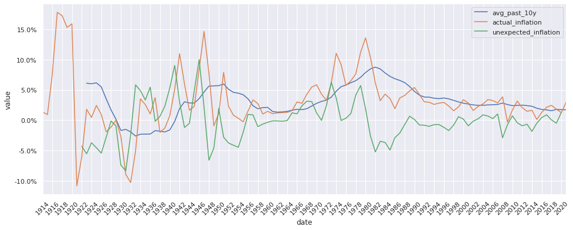
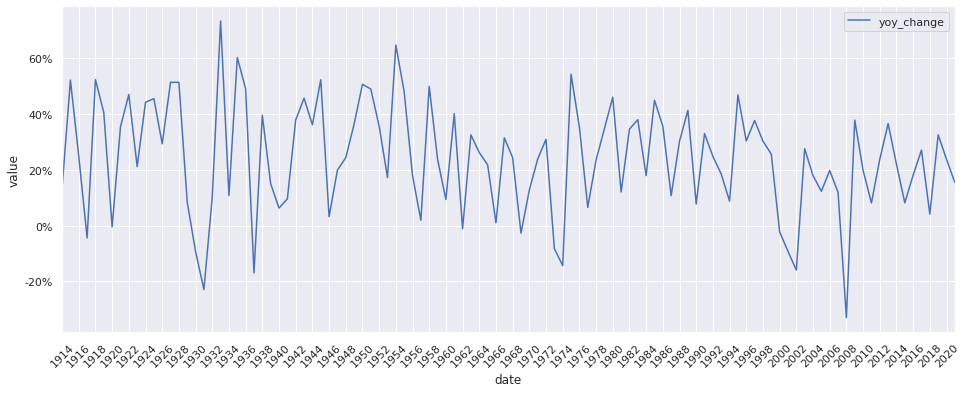
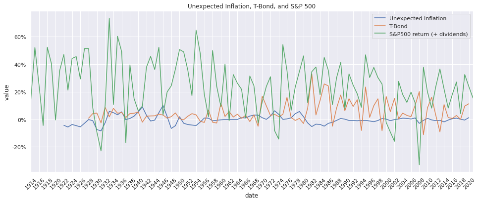
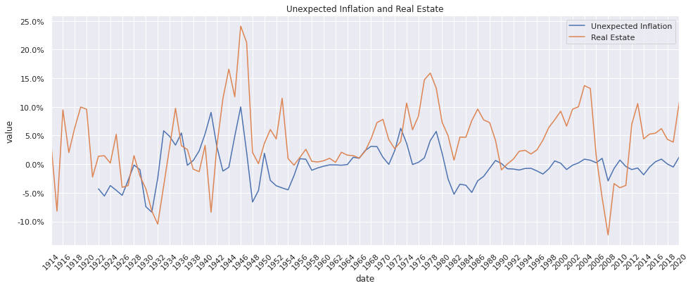
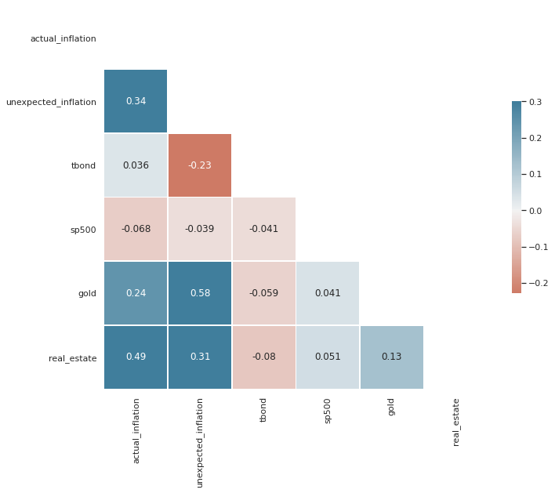

# Which Asset Class is safe against unexpected inflation?

This notebook attempts to duplicate this analysis by prof. Damodaran:

[Inflation and Investing: False Alarm or Fair Warning?](https://www.youtube.com/watch?v=p0vqmjgF3E4)

I thought it might be interesting to be able to get the latest data whenever we need to perform this analysis in the future.

Data source locations:

- Inflation: https://www.quandl.com/data/RATEINF/CPI_USA-Consumer-Price-Index-USA
- T-Bond: [Damodaran Online: Historical Returns on Stocks, Bonds and Bills](http://pages.stern.nyu.edu/~adamodar/New_Home_Page/datafile/histretSP.html) (I could not find a larger data source than the one in prof. Damodaran's website so I used it)
- S&P 500 and Real Estate: [ONLINE DATA ROBERT SHILLER](http://www.econ.yale.edu/~shiller/data.htm) (Much thanks to Prof. Robert J. Shiller for providing this dataset)


```python
import numpy as np
import pandas as pd
from matplotlib import pyplot as plt
import seaborn as sns
from pandas.tseries.offsets import MonthEnd, YearEnd, YearBegin

import matplotlib.dates as mdates
import matplotlib.ticker as mtick

INFLATION_DATA = 'data/inflation.csv'
TBOND_DATA = 'data/histretSP.xls'
SP500_DATA = 'data/sp500.xls'
GOLD_DATA = 'data/gold.xlsx'
REAL_ESTATE_DATA = 'data/real_estate.xls'
```

## 1. Prepare Expected and Unexpected Inflation Rates


```python
inf = pd.read_csv(INFLATION_DATA)
inf = inf.rename(columns={'Date': 'date', 'Value': 'value'})
inf['date'] = pd.to_datetime(inf['date'])
inf.set_index('date', inplace=True)
inf['value'] = inf['value'] / 100
inf = inf.groupby(pd.Grouper(freq="Y")).value.mean().to_frame(name='actual_inflation')
```


```python
plt.figure(figsize=(16, 6))
sns.set_theme()
sns.lineplot(data=inf, x=inf.index, y="actual_inflation");
```


```python
inf.index
```


    DatetimeIndex(['1914-12-31', '1915-12-31', '1916-12-31', '1917-12-31',
                   '1918-12-31', '1919-12-31', '1920-12-31', '1921-12-31',
                   '1922-12-31', '1923-12-31',
                   ...
                   '2012-12-31', '2013-12-31', '2014-12-31', '2015-12-31',
                   '2016-12-31', '2017-12-31', '2018-12-31', '2019-12-31',
                   '2020-12-31', '2021-12-31'],
                  dtype='datetime64[ns]', name='date', length=108, freq='A-DEC')


```python
inf = inf.sort_values(by='date')
inf['avg_past_10y'] = inf['actual_inflation'].rolling(10).mean()
inf['unexpected_inflation'] = inf['actual_inflation'] - inf['avg_past_10y']

# Unexpected inflation is a hindsight measurement, so if we have calculated for
# year 1947, for example, then the result is stored for year 1946.
inf['unexpected_inflation'] = inf['unexpected_inflation'].shift(-1)
# inf = inf.dropna()
inf
```


<div>
<style scoped>
    .dataframe tbody tr th:only-of-type {
        vertical-align: middle;
    }

    .dataframe tbody tr th {
        vertical-align: top;
    }

    .dataframe thead th {
        text-align: right;
    }
</style>
<table border="1" class="dataframe">
  <thead>
    <tr style="text-align: right;">
      <th></th>
      <th>actual_inflation</th>
      <th>avg_past_10y</th>
      <th>unexpected_inflation</th>
    </tr>
    <tr>
      <th>date</th>
      <th></th>
      <th></th>
      <th></th>
    </tr>
  </thead>
  <tbody>
    <tr>
      <th>1914-12-31</th>
      <td>0.013494</td>
      <td>NaN</td>
      <td>NaN</td>
    </tr>
    <tr>
      <th>1915-12-31</th>
      <td>0.009234</td>
      <td>NaN</td>
      <td>NaN</td>
    </tr>
    <tr>
      <th>1916-12-31</th>
      <td>0.076426</td>
      <td>NaN</td>
      <td>NaN</td>
    </tr>
    <tr>
      <th>1917-12-31</th>
      <td>0.178002</td>
      <td>NaN</td>
      <td>NaN</td>
    </tr>
    <tr>
      <th>1918-12-31</th>
      <td>0.172546</td>
      <td>NaN</td>
      <td>NaN</td>
    </tr>
    <tr>
      <th>...</th>
      <td>...</td>
      <td>...</td>
      <td>...</td>
    </tr>
    <tr>
      <th>2017-12-31</th>
      <td>0.021301</td>
      <td>0.016981</td>
      <td>0.008850</td>
    </tr>
    <tr>
      <th>2018-12-31</th>
      <td>0.024428</td>
      <td>0.015578</td>
      <td>0.000389</td>
    </tr>
    <tr>
      <th>2019-12-31</th>
      <td>0.018117</td>
      <td>0.017727</td>
      <td>-0.004953</td>
    </tr>
    <tr>
      <th>2020-12-31</th>
      <td>0.012367</td>
      <td>0.017320</td>
      <td>0.012564</td>
    </tr>
    <tr>
      <th>2021-12-31</th>
      <td>0.029698</td>
      <td>0.017134</td>
      <td>NaN</td>
    </tr>
  </tbody>
</table>
<p>108 rows × 3 columns</p>
</div>


```python
def plot_multilines(df, x, Y):
    df_plot = df.reset_index()[[x]+Y]
    df_plot[x] = df_plot[x] - YearBegin(1)
    df_plot = df_plot.melt(x, var_name='cols', value_name='vals')
    plt.figure(figsize=(16, 6))
    sns.set_theme()
    ax = sns.lineplot(x=x, y='vals', hue='cols', data=df_plot)
    return ax
    
def style(ax, labels=None, year_gap=2):
    ax.xaxis.set_major_locator(mdates.YearLocator(year_gap))
    ax.xaxis.set_major_formatter(mdates.DateFormatter("%Y"))
    ax.yaxis.set_major_formatter(mtick.PercentFormatter(1.0))
    ax.margins(x=0)
    ax.set(ylabel="value")
    ax.legend(title="")
    if labels != None:
        legend = ax.legend()
        for i, l in enumerate(labels):
            legend.texts[i].set_text(l)
    return plt.xticks(rotation=45)

ax = plot_multilines(inf, 'date', ['avg_past_10y', 'actual_inflation', 'unexpected_inflation'])
ax = style(ax);
```





## 2. T-Bond


```python
tbond = pd.read_excel(TBOND_DATA,
                      sheet_name="S&P 500 & Raw Data",
                      skiprows=list(range(0,1)))
tbond = tbond[['Year', 'Return on bond']]
tbond = tbond.rename(columns={'Year': 'date', 'Return on bond': 'yield'})
tbond['date'] = pd.to_datetime(tbond['date'], format='%Y') + YearEnd(1)
tbond = tbond.set_index('date')
tbond = tbond.dropna()
```


```python
tbond.head(5)
```


<div>
<style scoped>
    .dataframe tbody tr th:only-of-type {
        vertical-align: middle;
    }

    .dataframe tbody tr th {
        vertical-align: top;
    }

    .dataframe thead th {
        text-align: right;
    }
</style>
<table border="1" class="dataframe">
  <thead>
    <tr style="text-align: right;">
      <th></th>
      <th>yield</th>
    </tr>
    <tr>
      <th>date</th>
      <th></th>
    </tr>
  </thead>
  <tbody>
    <tr>
      <th>1928-12-31</th>
      <td>0.008355</td>
    </tr>
    <tr>
      <th>1929-12-31</th>
      <td>0.042038</td>
    </tr>
    <tr>
      <th>1930-12-31</th>
      <td>0.045409</td>
    </tr>
    <tr>
      <th>1931-12-31</th>
      <td>-0.025589</td>
    </tr>
    <tr>
      <th>1932-12-31</th>
      <td>0.087903</td>
    </tr>
  </tbody>
</table>
</div>


```python
combined1 = pd.merge(inf, tbond, left_on='date', right_on='date', how='left')
combined1 = combined1.rename(columns={'yield': 'tbond'})
combined1 = combined1[['actual_inflation', 'unexpected_inflation', 'tbond']]
```


```python
ax = plot_multilines(combined1, 'date', ['unexpected_inflation', 'tbond'])
style(ax, ["Unexpected Inflation", "T-Bond return"])
ax.set_title("Unexpected Inflation and T-Bond");
```


## 3. S&P 500 Index


```python
sp500 = pd.read_excel(SP500_DATA,
                      sheet_name="Data",
                      skiprows=list(range(0,7))
                      )
sp500 = sp500.iloc[:-1, :3]
sp500 = sp500.rename(columns={'Date': 'date', 'P': 'price', 'D': 'dividend'})

# 1871.1 to 1871.10
sp500['date'] = sp500['date'].apply(lambda x: '{0:.2f}'.format(x))

sp500['date'] = sp500['date'].astype(str)
sp500['price'] = sp500['price'].astype(float)
sp500['date'] = pd.to_datetime(sp500['date'], format="%Y.%m")
sp500['date'] = sp500['date'] + MonthEnd(1)
sp500.set_index('date', inplace=True)
```


```python
def get_total_dividends(df):
    g = df.groupby(pd.Grouper(freq="Q-DEC"))
    g = g.last().groupby(pd.Grouper(freq="Y")).sum()
    g = g['dividend']
    return g

def get_earnings_plus_dividends_yoy(df, dividends):
    g = df.groupby(pd.Grouper(freq="Y"))
    prev_dividends = dividends.shift(1)
    firstp = g.price.last().shift(1)
    firstp_div = firstp + prev_dividends
    lastp = g.price.last()
    lastp_div = lastp + dividends
    comb = firstp.to_frame(name='first') \
           .join(lastp.to_frame(name='last')) \
           .join(dividends.to_frame(name='dividends')) \
           .join(lastp_div.to_frame(name='last_plus_dividends'))
    comb['yoy_change'] = (comb['last_plus_dividends'] / comb['first']) - 1
#     comb['earnings'] = g.earnings_default.last()
    return comb
divs = get_total_dividends(sp500)
sp500g = get_earnings_plus_dividends_yoy(sp500, divs)
sp500g = sp500g[sp500g.index.year >= inf.index[0].year]
sp500g
```


<div>
<style scoped>
    .dataframe tbody tr th:only-of-type {
        vertical-align: middle;
    }

    .dataframe tbody tr th {
        vertical-align: top;
    }

    .dataframe thead th {
        text-align: right;
    }
</style>
<table border="1" class="dataframe">
  <thead>
    <tr style="text-align: right;">
      <th></th>
      <th>first</th>
      <th>last</th>
      <th>dividends</th>
      <th>last_plus_dividends</th>
      <th>yoy_change</th>
    </tr>
    <tr>
      <th>date</th>
      <th></th>
      <th></th>
      <th></th>
      <th></th>
      <th></th>
    </tr>
  </thead>
  <tbody>
    <tr>
      <th>1914-12-31</th>
      <td>8.040000</td>
      <td>7.350000</td>
      <td>1.770000</td>
      <td>9.120000</td>
      <td>0.134328</td>
    </tr>
    <tr>
      <th>1915-12-31</th>
      <td>7.350000</td>
      <td>9.480000</td>
      <td>1.705000</td>
      <td>11.185000</td>
      <td>0.521769</td>
    </tr>
    <tr>
      <th>1916-12-31</th>
      <td>9.480000</td>
      <td>9.800000</td>
      <td>2.045000</td>
      <td>11.845000</td>
      <td>0.249473</td>
    </tr>
    <tr>
      <th>1917-12-31</th>
      <td>9.800000</td>
      <td>6.800000</td>
      <td>2.565000</td>
      <td>9.365000</td>
      <td>-0.044388</td>
    </tr>
    <tr>
      <th>1918-12-31</th>
      <td>6.800000</td>
      <td>7.900000</td>
      <td>2.460000</td>
      <td>10.360000</td>
      <td>0.523529</td>
    </tr>
    <tr>
      <th>...</th>
      <td>...</td>
      <td>...</td>
      <td>...</td>
      <td>...</td>
      <td>...</td>
    </tr>
    <tr>
      <th>2017-12-31</th>
      <td>2246.630000</td>
      <td>2664.340000</td>
      <td>190.700000</td>
      <td>2855.040000</td>
      <td>0.270810</td>
    </tr>
    <tr>
      <th>2018-12-31</th>
      <td>2664.340000</td>
      <td>2567.310000</td>
      <td>207.080000</td>
      <td>2774.390000</td>
      <td>0.041305</td>
    </tr>
    <tr>
      <th>2019-12-31</th>
      <td>2567.310000</td>
      <td>3176.749524</td>
      <td>226.477275</td>
      <td>3403.226799</td>
      <td>0.325600</td>
    </tr>
    <tr>
      <th>2020-12-31</th>
      <td>3176.749524</td>
      <td>3695.310000</td>
      <td>236.389450</td>
      <td>3931.699450</td>
      <td>0.237649</td>
    </tr>
    <tr>
      <th>2021-12-31</th>
      <td>3695.310000</td>
      <td>4208.120000</td>
      <td>57.633387</td>
      <td>4265.753387</td>
      <td>0.154370</td>
    </tr>
  </tbody>
</table>
<p>108 rows × 5 columns</p>
</div>


```python
ax = plot_multilines(sp500g, 'date', ['yoy_change'])
style(ax);
```





### Merging unexpected inflation + S&P 500 Index


```python
combined2 = pd.merge(combined1, sp500g, left_on='date', right_on='date', how='left')
combined2 = combined2.rename(columns={'yoy_change': 'sp500'})
combined2 = combined2[['actual_inflation', 'unexpected_inflation', 'tbond', 'sp500']]
```


```python
combined2
```


<div>
<style scoped>
    .dataframe tbody tr th:only-of-type {
        vertical-align: middle;
    }

    .dataframe tbody tr th {
        vertical-align: top;
    }

    .dataframe thead th {
        text-align: right;
    }
</style>
<table border="1" class="dataframe">
  <thead>
    <tr style="text-align: right;">
      <th></th>
      <th>actual_inflation</th>
      <th>unexpected_inflation</th>
      <th>tbond</th>
      <th>sp500</th>
    </tr>
    <tr>
      <th>date</th>
      <th></th>
      <th></th>
      <th></th>
      <th></th>
    </tr>
  </thead>
  <tbody>
    <tr>
      <th>1914-12-31</th>
      <td>0.013494</td>
      <td>NaN</td>
      <td>NaN</td>
      <td>0.134328</td>
    </tr>
    <tr>
      <th>1915-12-31</th>
      <td>0.009234</td>
      <td>NaN</td>
      <td>NaN</td>
      <td>0.521769</td>
    </tr>
    <tr>
      <th>1916-12-31</th>
      <td>0.076426</td>
      <td>NaN</td>
      <td>NaN</td>
      <td>0.249473</td>
    </tr>
    <tr>
      <th>1917-12-31</th>
      <td>0.178002</td>
      <td>NaN</td>
      <td>NaN</td>
      <td>-0.044388</td>
    </tr>
    <tr>
      <th>1918-12-31</th>
      <td>0.172546</td>
      <td>NaN</td>
      <td>NaN</td>
      <td>0.523529</td>
    </tr>
    <tr>
      <th>...</th>
      <td>...</td>
      <td>...</td>
      <td>...</td>
      <td>...</td>
    </tr>
    <tr>
      <th>2017-12-31</th>
      <td>0.021301</td>
      <td>0.008850</td>
      <td>0.028017</td>
      <td>0.270810</td>
    </tr>
    <tr>
      <th>2018-12-31</th>
      <td>0.024428</td>
      <td>0.000389</td>
      <td>-0.000167</td>
      <td>0.041305</td>
    </tr>
    <tr>
      <th>2019-12-31</th>
      <td>0.018117</td>
      <td>-0.004953</td>
      <td>0.096356</td>
      <td>0.325600</td>
    </tr>
    <tr>
      <th>2020-12-31</th>
      <td>0.012367</td>
      <td>0.012564</td>
      <td>0.113319</td>
      <td>0.237649</td>
    </tr>
    <tr>
      <th>2021-12-31</th>
      <td>0.029698</td>
      <td>NaN</td>
      <td>NaN</td>
      <td>0.154370</td>
    </tr>
  </tbody>
</table>
<p>108 rows × 4 columns</p>
</div>


```python
ax = plot_multilines(combined2, 'date', ['unexpected_inflation', 'tbond', 'sp500'])
style(ax, ["Unexpected Inflation", "T-Bond", "S&P500 return (+ dividends)"])
ax.set_title("Unexpected Inflation, T-Bond, and S&P 500");
```





## 4. Gold


```python
gold = pd.read_excel(GOLD_DATA,
                     sheet_name="Annual_EndofPeriod",
                     skiprows=list(range(0,9)),
                     header=None,
                     engine="openpyxl")
gold = gold.iloc[:, 3:5]
gold = gold.rename(columns={3: 'date', 4: 'price'})
gold['date'] = pd.to_datetime(gold['date'], format='%Y') + YearEnd(1)
gold = gold.set_index('date')
gold['firstp'] = gold['price'].shift(1)
gold['yoy_change'] = (gold['price'] / gold['firstp']) - 1
```


```python
gold.head(5)
```


<div>
<style scoped>
    .dataframe tbody tr th:only-of-type {
        vertical-align: middle;
    }

    .dataframe tbody tr th {
        vertical-align: top;
    }

    .dataframe thead th {
        text-align: right;
    }
</style>
<table border="1" class="dataframe">
  <thead>
    <tr style="text-align: right;">
      <th></th>
      <th>price</th>
      <th>firstp</th>
      <th>yoy_change</th>
    </tr>
    <tr>
      <th>date</th>
      <th></th>
      <th></th>
      <th></th>
    </tr>
  </thead>
  <tbody>
    <tr>
      <th>1978-12-31</th>
      <td>226.00</td>
      <td>NaN</td>
      <td>NaN</td>
    </tr>
    <tr>
      <th>1979-12-31</th>
      <td>512.00</td>
      <td>226.00</td>
      <td>1.265487</td>
    </tr>
    <tr>
      <th>1980-12-31</th>
      <td>589.75</td>
      <td>512.00</td>
      <td>0.151855</td>
    </tr>
    <tr>
      <th>1981-12-31</th>
      <td>397.50</td>
      <td>589.75</td>
      <td>-0.325986</td>
    </tr>
    <tr>
      <th>1982-12-31</th>
      <td>456.90</td>
      <td>397.50</td>
      <td>0.149434</td>
    </tr>
  </tbody>
</table>
</div>


```python
combined3 = pd.merge(combined2, gold, left_on='date', right_on='date', how='left')
combined3 = combined3.rename(columns={'yoy_change': 'gold'})
combined3 = combined3[['actual_inflation', 'unexpected_inflation', 'tbond', 'sp500', 'gold']]
```


```python
combined3
```


<div>
<style scoped>
    .dataframe tbody tr th:only-of-type {
        vertical-align: middle;
    }

    .dataframe tbody tr th {
        vertical-align: top;
    }

    .dataframe thead th {
        text-align: right;
    }
</style>
<table border="1" class="dataframe">
  <thead>
    <tr style="text-align: right;">
      <th></th>
      <th>actual_inflation</th>
      <th>unexpected_inflation</th>
      <th>tbond</th>
      <th>sp500</th>
      <th>gold</th>
    </tr>
    <tr>
      <th>date</th>
      <th></th>
      <th></th>
      <th></th>
      <th></th>
      <th></th>
    </tr>
  </thead>
  <tbody>
    <tr>
      <th>1914-12-31</th>
      <td>0.013494</td>
      <td>NaN</td>
      <td>NaN</td>
      <td>0.134328</td>
      <td>NaN</td>
    </tr>
    <tr>
      <th>1915-12-31</th>
      <td>0.009234</td>
      <td>NaN</td>
      <td>NaN</td>
      <td>0.521769</td>
      <td>NaN</td>
    </tr>
    <tr>
      <th>1916-12-31</th>
      <td>0.076426</td>
      <td>NaN</td>
      <td>NaN</td>
      <td>0.249473</td>
      <td>NaN</td>
    </tr>
    <tr>
      <th>1917-12-31</th>
      <td>0.178002</td>
      <td>NaN</td>
      <td>NaN</td>
      <td>-0.044388</td>
      <td>NaN</td>
    </tr>
    <tr>
      <th>1918-12-31</th>
      <td>0.172546</td>
      <td>NaN</td>
      <td>NaN</td>
      <td>0.523529</td>
      <td>NaN</td>
    </tr>
    <tr>
      <th>...</th>
      <td>...</td>
      <td>...</td>
      <td>...</td>
      <td>...</td>
      <td>...</td>
    </tr>
    <tr>
      <th>2017-12-31</th>
      <td>0.021301</td>
      <td>0.008850</td>
      <td>0.028017</td>
      <td>0.270810</td>
      <td>0.126625</td>
    </tr>
    <tr>
      <th>2018-12-31</th>
      <td>0.024428</td>
      <td>0.000389</td>
      <td>-0.000167</td>
      <td>0.041305</td>
      <td>-0.009295</td>
    </tr>
    <tr>
      <th>2019-12-31</th>
      <td>0.018117</td>
      <td>-0.004953</td>
      <td>0.096356</td>
      <td>0.325600</td>
      <td>0.184324</td>
    </tr>
    <tr>
      <th>2020-12-31</th>
      <td>0.012367</td>
      <td>0.012564</td>
      <td>0.113319</td>
      <td>0.237649</td>
      <td>0.246146</td>
    </tr>
    <tr>
      <th>2021-12-31</th>
      <td>0.029698</td>
      <td>NaN</td>
      <td>NaN</td>
      <td>0.154370</td>
      <td>NaN</td>
    </tr>
  </tbody>
</table>
<p>108 rows × 5 columns</p>
</div>


```python
ax = plot_multilines(combined3, 'date', ['unexpected_inflation', 'tbond', 'sp500', 'gold'])
style(ax, ["Unexpected Inflation", "T-Bond", "S&P500 (+dividends)", "Gold"])
ax.set_title("Unexpected Inflation, T-Bond, S&P 500, and Gold");
```


## 5. Real Estate


```python
real_estate = pd.read_excel(REAL_ESTATE_DATA,
                            sheet_name="Data",
                            skiprows=list(range(0,6)),
                            engine="xlrd")
real_estate = real_estate.rename(columns={'Date': 'year', 'From fig2.1Revised2011.xls': 'index'})
real_estate = real_estate[['year', 'index']]
real_estate = real_estate.dropna()

def impute_values(df, id_field, value_field):
    """ Impute missing values in `df` by looking at id differences.
    
    
    """
    real_estate.loc[real_estate[id_field] % 1 == 0, id_field] = \
        real_estate.loc[real_estate[id_field] % 1 == 0, id_field] + 1
    
    indexes = pd.Index(np.arange(df[id_field].min(), df[id_field].max(), 1))
    df1 = df.set_index(id_field)
    missing_indexes = indexes.difference(df1.index)
    for idx in missing_indexes:
        df1.loc[idx, value_field] = None
    df1 = df1.sort_index()
    df1[value_field] = df1[value_field].interpolate(method='linear')
    df1 = df1.loc[df1.index % 1 == 0].shift(-1)
    return df1

real_estate = impute_values(real_estate, 'year', 'index')

real_estate['date'] = pd.to_datetime(real_estate.index.astype(int), format="%Y") + YearEnd(1)
real_estate = real_estate.set_index('date')
real_estate['prev_index'] = real_estate['index'].shift(1)
real_estate['yoy_change'] = real_estate['index'] / real_estate['prev_index'] - 1
real_estate = real_estate.dropna()
real_estate['yoy_change'] = real_estate['yoy_change'].astype(float)
```


```python
combined4 = pd.merge(combined3, real_estate, left_on='date', right_on='date')
combined4 = combined4.rename(columns={'yoy_change': 'real_estate'})
combined4 = combined4[['actual_inflation', 'unexpected_inflation', 'tbond', 'sp500', 'gold', 'real_estate']]
```


```python
combined4
```


<div>
<style scoped>
    .dataframe tbody tr th:only-of-type {
        vertical-align: middle;
    }

    .dataframe tbody tr th {
        vertical-align: top;
    }

    .dataframe thead th {
        text-align: right;
    }
</style>
<table border="1" class="dataframe">
  <thead>
    <tr style="text-align: right;">
      <th></th>
      <th>actual_inflation</th>
      <th>unexpected_inflation</th>
      <th>tbond</th>
      <th>sp500</th>
      <th>gold</th>
      <th>real_estate</th>
    </tr>
    <tr>
      <th>date</th>
      <th></th>
      <th></th>
      <th></th>
      <th></th>
      <th></th>
      <th></th>
    </tr>
  </thead>
  <tbody>
    <tr>
      <th>1914-12-31</th>
      <td>0.013494</td>
      <td>NaN</td>
      <td>NaN</td>
      <td>0.134328</td>
      <td>NaN</td>
      <td>0.037185</td>
    </tr>
    <tr>
      <th>1915-12-31</th>
      <td>0.009234</td>
      <td>NaN</td>
      <td>NaN</td>
      <td>0.521769</td>
      <td>NaN</td>
      <td>-0.081946</td>
    </tr>
    <tr>
      <th>1916-12-31</th>
      <td>0.076426</td>
      <td>NaN</td>
      <td>NaN</td>
      <td>0.249473</td>
      <td>NaN</td>
      <td>0.094840</td>
    </tr>
    <tr>
      <th>1917-12-31</th>
      <td>0.178002</td>
      <td>NaN</td>
      <td>NaN</td>
      <td>-0.044388</td>
      <td>NaN</td>
      <td>0.020382</td>
    </tr>
    <tr>
      <th>1918-12-31</th>
      <td>0.172546</td>
      <td>NaN</td>
      <td>NaN</td>
      <td>0.523529</td>
      <td>NaN</td>
      <td>0.063670</td>
    </tr>
    <tr>
      <th>...</th>
      <td>...</td>
      <td>...</td>
      <td>...</td>
      <td>...</td>
      <td>...</td>
      <td>...</td>
    </tr>
    <tr>
      <th>2016-12-31</th>
      <td>0.012636</td>
      <td>0.004320</td>
      <td>0.006906</td>
      <td>0.180918</td>
      <td>0.081038</td>
      <td>0.054080</td>
    </tr>
    <tr>
      <th>2017-12-31</th>
      <td>0.021301</td>
      <td>0.008850</td>
      <td>0.028017</td>
      <td>0.270810</td>
      <td>0.126625</td>
      <td>0.062114</td>
    </tr>
    <tr>
      <th>2018-12-31</th>
      <td>0.024428</td>
      <td>0.000389</td>
      <td>-0.000167</td>
      <td>0.041305</td>
      <td>-0.009295</td>
      <td>0.043357</td>
    </tr>
    <tr>
      <th>2019-12-31</th>
      <td>0.018117</td>
      <td>-0.004953</td>
      <td>0.096356</td>
      <td>0.325600</td>
      <td>0.184324</td>
      <td>0.038500</td>
    </tr>
    <tr>
      <th>2020-12-31</th>
      <td>0.012367</td>
      <td>0.012564</td>
      <td>0.113319</td>
      <td>0.237649</td>
      <td>0.246146</td>
      <td>0.107829</td>
    </tr>
  </tbody>
</table>
<p>107 rows × 6 columns</p>
</div>


```python
ax = plot_multilines(combined4, 'date', ['unexpected_inflation', 'real_estate'])
style(ax, ["Unexpected Inflation", "Real Estate"])
ax.set_title("Unexpected Inflation and Real Estate");
```





## 6. Correlation Analysis


```python
corr = combined4[['actual_inflation', 'unexpected_inflation', 'tbond', 'sp500', 'gold', 'real_estate']].corr()
corr
```


<div>
<style scoped>
    .dataframe tbody tr th:only-of-type {
        vertical-align: middle;
    }

    .dataframe tbody tr th {
        vertical-align: top;
    }

    .dataframe thead th {
        text-align: right;
    }
</style>
<table border="1" class="dataframe">
  <thead>
    <tr style="text-align: right;">
      <th></th>
      <th>actual_inflation</th>
      <th>unexpected_inflation</th>
      <th>tbond</th>
      <th>sp500</th>
      <th>gold</th>
      <th>real_estate</th>
    </tr>
  </thead>
  <tbody>
    <tr>
      <th>actual_inflation</th>
      <td>1.000000</td>
      <td>0.337851</td>
      <td>0.036066</td>
      <td>-0.067791</td>
      <td>0.241603</td>
      <td>0.486498</td>
    </tr>
    <tr>
      <th>unexpected_inflation</th>
      <td>0.337851</td>
      <td>1.000000</td>
      <td>-0.227691</td>
      <td>-0.038707</td>
      <td>0.575756</td>
      <td>0.309312</td>
    </tr>
    <tr>
      <th>tbond</th>
      <td>0.036066</td>
      <td>-0.227691</td>
      <td>1.000000</td>
      <td>-0.041323</td>
      <td>-0.059320</td>
      <td>-0.079842</td>
    </tr>
    <tr>
      <th>sp500</th>
      <td>-0.067791</td>
      <td>-0.038707</td>
      <td>-0.041323</td>
      <td>1.000000</td>
      <td>0.040701</td>
      <td>0.050887</td>
    </tr>
    <tr>
      <th>gold</th>
      <td>0.241603</td>
      <td>0.575756</td>
      <td>-0.059320</td>
      <td>0.040701</td>
      <td>1.000000</td>
      <td>0.128492</td>
    </tr>
    <tr>
      <th>real_estate</th>
      <td>0.486498</td>
      <td>0.309312</td>
      <td>-0.079842</td>
      <td>0.050887</td>
      <td>0.128492</td>
      <td>1.000000</td>
    </tr>
  </tbody>
</table>
</div>


```python
sns.set_theme(style="white")
mask = np.triu(np.ones_like(corr, dtype=bool))
f, ax = plt.subplots(figsize=(11, 9))
cmap = sns.diverging_palette(20, 230, as_cmap=True)
sns.heatmap(corr, mask=mask, cmap=cmap, vmax=.3, center=0,
            square=True, linewidths=.5, cbar_kws={"shrink": .5},
            annot=True);
```





### Conclusions

1. Gold and Real estate are a good hedge for inflation.
2. Real estate performed better than gold in an environment with high actual inflation rate.
